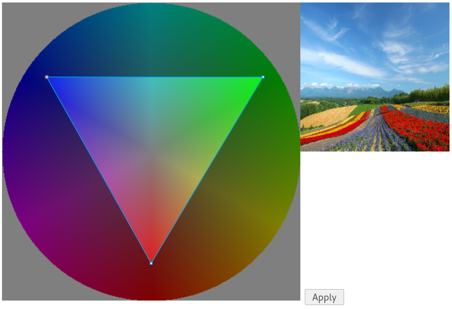

#What is a gamut mask?
Gamut masking is a process of limiting the amount of hues to a predefined set, usually in a shape of triangle in hue circle. You can read more about it [here](http://joostdevblog.blogspot.com/2015/01/a-tool-for-analysing-colour-schemes.html) and [here](http://gurneyjourney.blogspot.com/2008/01/color-wheel-masking-part-1.html).

#Live demo

#Example

